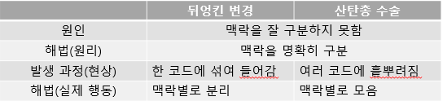

# Chapter 3. 코드에서 나는 악취 - 113p.

'적용 방법'을 아는 것과 '제때 적용'할 줄 아는 것은 다르다.  
리팩터링을 언제 시작하고 언제 그만할지를 판단하는 일은 리팩터링의 작동 원리를 아는 것 못지않게 중요하다.  
종료 시점은 숙련된 사람의 직관만큼 정확한 기준이 없기 때문에 리팩터링하면 해결할 수 있는 문제의 징후를 제시한다.  
(인스턴스 변수는 몇 개가 적당한지, 메서드가 몇 줄을 넘어가면 안 좋은지 등은 각자 경험을 통해 감을 키워야 한다.)

## Key Point

- 추리 소설이라면 무슨 일이 전개되는지 궁금증을 자아낼수록 좋겠지만 코드는 아니다. `코드는 단순하고 명료하게 작성해야 한다.`
- 적당한 이름이 떠오르지 않는다면 성격이 다른 두 가지 작업이 섞여 있을 수 있다.

## 기이한 이름 - Mysterious Name

- 이름만 잘 지어도 나중에 **_문맥을 파악하느라 헤매는 시간을 크게 절약할 수 있다._**
- 마땅한 이름이 떠오르지 않는다면 설계에 **_더 근본적인 문제가 숨어 있을 가능성이 높다._**
- 리팩토링 기법: 함수 선언 바꾸기(6.5절) / 변수 이름 바꾸기(6.7절) / 필드 이름 바꾸기(9.2절)

## 중복 코드 - Duplicated Code

- 똑같은 코드 구조가 여러 곳에서 반복된다면 하나로 통합하여 더 나은 프로그램을 만들 수 있다.
- 코드 중복은 각 코드를 볼 때 서로 차이점은 없는지 주의 깊게 살펴봐야 하는 부담이 생긴다.
- 리팩토링 기법: 함수 추출하기(6.1절) / 문장 슬라이드하기(8.6절) / 메서드 올리기(12.1절)

## 긴 함수 - Long Function

- **_저자의 경험에 비춰보면 오랜 기간 잘 활용되는 프로그램들은 짧은 함수로 구성되어 있다._**
- 간접 호출(indirection)의 효과, 즉 코드를 이해하고, 공유하고, 선택하기 쉬워진다는 장점은 함수를 짧게 구성할 때 나온다.
- 코드가 단 한줄이어도 설명(주석)이 필요하다면 함수의 목적(의도)을 잘 설명할 수 있는 이름의 함수로 추출한다.
- 즉, '무엇을 하는지'를 코드가 잘 설명해주지 못할수록 함수로 만드는게 유리하다.
- 리팩토링 기법: 함수 추출하기(6.1절) / 임시 변수를 질의 함수로 바꾸기(7.4절) / 매개변수 객체 만들기(6.8절) / 객체 통째로 넘기기(11.4절) / 함수를 명령으로 바꾸기(11.9절) / 조건문 분해하기(10.1절) / 조건문을 다형성으로 바꾸기(10.4절) / 반복문 쪼개기(8.7절)

## 긴 매개변수 목록 - Long Parameter List

- **_매개변수 목록이 길어지면 그 자체로 이해하기 어려울 때가 많다._**
- 다른 매개변수에서 값을 얻어올 수 있는 매개변수가 있을 수 있는데 이럴 때는 매개변수를 질의함수로 바꾸기(11.5절)로 제거할 수 있다.
- 사용 중인 데이터 구조에서 값들을 뽑아 각각을 별개의 매개변수로 전달하는 코드라면 객체 통째로 넘기기(11.4절)로 원본 데이터 구조를 그대로 전달한다.
- 항상 함께 전달되는 매개변수들은 매개변수 객체만들기(6.8절)로 하나로 묶어버린다.
- 함수의 동작 방식을 정하는 플래그 역할의 매개변수는 플래그 인수 제거하기(11.3절)로 제거한다.
- 여러 개의 함수가 특정 매개변수들의 값을 공통으로 사용한다면 여러 함수를 클래스로 묶기(6.9절)로 공통 값들을 클래스의 필드로 정의한다.
- 리팩토링 기법: 매개변수를 질의함수로 바꾸기(11.5절) / 객체 통째로 넘기기(11.4절) / 매개변수 객체 만들기(6.8절) / 플래그 인수 제거하기(11.3절) / 여러 함수를 클래스로 묶기(6.9절)

## 전역 데이터 - Global Data

- **_전역 데이터는 코드베이스 어디서든 건드릴 수 있기 때문에 버그가 끊임없이 발생하는데 원인이 되는 코드를 찾아내기가 굉장히 어렵다._**
- 대표적으로 전역 변수가 있지만 클래스 변수와 싱글톤에서도 같은 문제가 발생한다.
- 리팩토링 기법: 변수 캡슐화하기(6.6절)

## 가변 데이터 - Mutable Data

- **_다른 곳에서 다른 값을 기대한다는 사실을 인식하지 못한 채 데이터가 변경되면 예상치 못한 결과나 버그로 이어지는 경우가 종종 있다._**
- 리팩토링 기법: 변수 캡슐화하기(6.6절) / 변수 쪼개기(9.1절) / 문장 슬라이드(8.6절)와 함수 추출하기(6.1절) / 질의 함수와 변경 함수 분리하기(11.1절) / 세터 제거하기(11.7절) / 파생 변수를 질의 함수로 바꾸기(9.3절) / 여러 함수를 클래스로 묶기(6.9절) / 여러 함수를 변환 함수로 묶기 (6.10절) / 참조를 값으로 바꾸기(9.4절)

## 뒤엉킨 변경 - Divergent Change

- 코드를 수정할 때는 시스템에서 고쳐야 할 딱 한군데를 찾아서 수정할 수 있기를 바란다. 이렇게 할 수 없다면 뒤엉킨 변경과 산탄총 수술 중 하나가 풍긴다.
- 뒤엉킨 변경은 단일 책임 원칙(SRP)이 제대로 지켜지지 않을 때 나타난다. (하나의 모듈이 서로 다른 이유들로 인해 변경되서는 안된다.)
- 리팩토링 기법: 단계 쪼개기(6.11절) / 함수 옮기기(8.1절) / 클래스 추출하기(7.5절)
- 디자인 패턴으로는 전략 패턴(Strategy Pattern) / 방문자 패턴(Visitor Pattern) 그리고 켄트 백의 자기 위임(Self-Delegation)이 해당 문제를 없앨 떄 활용한다.

## 산탄총 수술 - Shotgun Surgery

- 코드를 변경할 때마다 자잘하게 수정해야 하는 클래스가 많을 때 풍긴다. 변경할 부분이 코드 전반에 퍼져 있다면 찾기도 어렵고 꼭 수정해야 할 곳을 지나치기 쉽다.
- 리팩토링 기법: 함께 변경되는 대상들을 함수 옮기기(8.1절)와 필드 옮기기(8.2절)로 한 모듈에 묶어두면 좋다. / 비슷한 데이터를 다루는 함수가 많다면 여러 함수를 클래스로 묶기(6.9절) / 데이터 구조를 변환하거나 보강(enrich)하는 함수들에는 여러 함수를 변환 함수로 묶기(6.10절) / 단계 쪼개기(6.11절) / 어설프레 분리된 로직은 함수 인라인하기(6.2절) 클래스 인라인하기(7.6절)

## 기능 편애 - Feature Envy

- 모듈화 할 때는 모듈 안 상호작용은 최대한 늘리고 모듈 간의 상호작용은 최소로 줄이는데 주력한다.
- 기능 편애는 어떤 함수가 자신이 속한 모듈 보다 다른 모듈의 함수나 데이터와 상호작용을 더 많이 하는 것이다.
- 리팩토링 기법: 함수 옮기기(8.1절)

## 데이터 뭉치 - Data Clumps

- 클래스 여러 곳의 필드 혹은 메서드의 시그니처에서 데이터 항목 서너 개가 뭉쳐다니는 모습을 흔히 볼 수 있다. 이런 경우 보금자리를 따로 마련해줘야 마땅하다.
- 값 하나를 삭제 했을 때 나머지 데이터만으로는 의미가 없다면 데이터 뭉치라는 뜻이다.
- 리팩토링 기법: 필드 형태의 데이터 뭉치를 찾아서 클래스 추출하기(7.5절)로 묶는다. / 메서드 시그니처에 있는 데이터 뭉치는 매개변수 객체 만들기(6.8절) 또는 객체 통째로 넘기기(11.4절)로 매개변수 수를 줄인다.

## 기본형 집착 - Primitive Obsession

- 기본형으로 쓰지 않는게 좋은데 편하려고 기본형을 고집하는 것
- 문자열에서 특히 심한데 전화번호, 화폐, 날짜를 단순히 문자 집합으로 표현하기엔 아쉬움이 많다.
- 리팩토링 기법: 기본형을 객체로 바꾸기: (7.3절) / 조건부 동작을 제어하는 타입 코드로 쓰였다면 타입 코드를 서브클래스로 바꾸기(12.6절)와 조건부 로직을 다형성으로 바꾸기(10.4절)을 차례로 적용

## 반복되는 switch문 - Repeated Switches

- 중복되는 switch문의 경우 조건절 하나가 추가될 때 마다 다른 switch문들도 모두 수정해야 하기 때문에 다형성을 활용하자
- 리팩토링 기법: 조건부 로직을 다형성으로 바꾸기(10.4절)

## 반복문 - Loops

- 각 원소들이 어떻게 처리되는지 쉽게 처리하자.
- 리팩토링 기법: 반복문을 파이프라인으로 바꾸기(8.8절)

## 성의 없는 요소 - Lazy Element

- 함수(메서드), 클래스, 인터페이스 등의 "프로그램 요소"가 필요 없어지면 제거하자
- 예를 들어, 본문 코드 반복이나 다를 바 없거나 메서드가 하나뿐인 클래스 등
- 리팩토링 기법: 함수 인라인하기(6.2절) / 클래스 인라인하기(7.6절) / 계층 합치기(12.9절)

## 추측성 일반화 - Speculative Generality

- 나중에 필요하다고 생각하여 후킹 포인트, 특이 케이스 처리 로직을 작성해둔 코드에서 풍긴다. 결과적으로 이해하거나 관리하기 어렵다.
- 리팩토링 기법: 하는 일이 거의 없는 추상 클래스는 계층 합치기(12.9절) / 쓸데없이 위임하는 코드는 함수 인라인하기(6.2절) 또는 클래스 인라인하기(7.6절) / 사용되지 않는 매개변수는 함수 선언 바꾸기(6.5절) / 죽은 코드 제거하기(8.9절)

## 임시 필드 - Temporary Field

- 객체를 가져올 때 모든 필드가 채워져 있으리라 기대하는게 보통이라, 특정 상황에서만 값이 설정되는 임시 필드는 코드를 이해하기 어렵게 만든다.
- 리팩토링 기법: 클래스 추출하기(7.5절)와 함수 옮기기(8.1절)로 임시 필드들과 관련된 코드를 새 클래스에 몰아넣는다. / 임시 필드들이 유효한지 확인 후 동작하는 조건부 로직이 있을 수 있는데 특이 케이스 추가하기(10.5절)로 필드들이 유효하지 않을 때를 위한 대안 클래스를 만들어서 제거할 수 있다.

## 메시지 체인 - Message Chains

- 메시지 체인은 클라이언트가 한 객체를 통해 다른 객체를 얻고 또 다른 객체를 요청하는 식으로 다른 객체를 요청하는 작업이 연쇄적으로 이어지는 코드를 말한다.
- 이는 클라이언트가 객체 내비게이션 구조에 종속되므로 내비게이션 중간 단계를 수정하면 클라이언트 코드도 수정해야 한다.
- 리팩토링 기법: 위임 숨기기(7.7절)는 메시지 체인의 다양한 연결점에 적용할 수 있다. / 함수 추출하기(6.1절)로 결과 객체를 사용하는 코드 일부를 따로 빼낸 다음 함수 옮기기(8.1절)로 체인을 숨길 수 있는지 살펴보자.

## 중개자 - Middle Man

- 객체의 대표적 기능으로 캡슐화가 있는데 캡슐화 하는 과정에서 위임이 자주 활용된다.
- 리팩토링 기법: 지나치면 문제가 되므로 클래스가 제공하는 메서드 중 절반이 다른 클래스 구현을 위임하고 있다면 중개자 제거하기(7.8절)을 활용하자.

## 내부자 거래 - Insider Trading

- 리팩토링 기법: 여러 모듈이 같은 관심사를 공유한다면 공통 부분을 정식으로 처리하는 제 3의 모듈을 새로 만들거나 위임 숨기기(7.7절)을 이용하여 다른 모듈이 중간자 역할을 하게 한다. / 상속 구조에서 부모 자식 사이에 결탁이 생긴다면 서브클래스를 위임으로 바꾸기(12.10절) 또는 슈퍼클래스를 위임으로 바꾸기(12.11절)을 활용

## 거대한 클래스 - Large Class

- 한 클래스가 많은 일을 하려다 보면 필드 수가 늘어나고 중복 코드도 생기기 쉽다.
- 리팩토링 기법: 클래스 추출하기(7.5절) depositAmount와 depositCurrency처럼 접두어나 접미어가 같은 필드들이 함께 추출될 후보들이다. 또는 클라이언트들이 클래스의 특정 기능 그룹만 사용하는것과 같이 패턴을 파악하여 어떻게 쪼갤지 단서를 얻을 수도 있다. / 만약 상속 관계가 더 괜찮다면 슈퍼 클래스 추출하기(12.8절) 또는 타입 코드를 서브클래스로 바꾸기(12.6절)을 적용하는 편이 쉽다.

## 서로 다른 인터페이스의 대안 클래스들 - Alternative Classes with Different Interfaces

- 클래스 사용의 큰 장점은 언제든 다른 클래스로 교체할 수 있다는 것이다만, 인터페이스가 같아야한다.
- 유사한 역할을 하는 클래스들이 있다면 동일 인터페이스를 갖는 다른 구현체로 만들어라
- 리팩토링 기법: 함수 선언 바꾸기(6.5절)로 메서드 시그니처를 일치 / 부족하다면 함수 옮기기(8.1절)로 인터페이스가 같아질 때 까지 필요한 동작을 클래스에 넣는다. / 중복 코드가 생기면 슈퍼클래스 추출하기(12.8절)를 고려해본다.

## 데이터 클래스 - Data Class

- 데이터 클래스란 데이터 필드와 게터/세터 메서드로만 구성된 클래스를 말한다.
- 데이터 저장용도로만 쓰이다 보니 다른 클래스가 너무 깊이까지 함부로 다룰 때가 많다.
- 필요한 동작이 엉뚱한 곳에 정의돼 있다는 신호일 수 있다. ex) A 클래스의 어떤 메서드가 데이터 클래스의 필드를 활용하는 경우(가공 등) 이 메서드가 데이터 클래스에 있는게 맞다는 신호일 수 있다.
- 리팩토링 기법: public 필드가 있다면 레코드 캡슐화하기(7.1절)로 숨기자. / 변경하면 안 되는 필드는 세터 제거하기(11.7절) / 다른 클래스에서 데이터 클래스의 게터/세터를 사용하는 메서드를 찾아서 함수 옮기기(8.1절) 또는 함수 추출하기(6.1절)이용해서 옮긴다.

## 상속 포기 - Refused Bequest

- 서브 클래스는 부모로부터 메서드와 데이터를 물려받는다. 하지만 부모의 유산을 원치 않거나 일부만 받고 싶다면?
- "예전에는" 계층구조를 잘못 설계했다고 보고 먼저 같은 계층에 서브 클래스를 하나 새로 만들고, 메서드 내리기(12.4절)와 필드 내리기(12.5절)로 물려받지 않을 부모 코드를 모조리 새로 만든 서브클래스로 넘겨서 부모에 공통된 부분만 남기는 방법을 썻다.
- 상속을 포기할 시 혼란과 문제가 생긴다면 "예전 방식"을 따르지만 항상 이렇게 해야 한다는 입장은 아니다. 왜냐하면 일부 동작을 재활용하기 위한 목적으로 상속을 활용하는 것은 유용하다. 냄새를 풍기긴 하지만 참을 만한 경우가 많다.
- 상속 포기 냄새는 서브클래스가 부모의 동작은 필요로하지만 인터페이스는 따르고 싶지 않을 때 특히 심하게 난다.
- 리팩토링 기법: 먼저 같은 계층에 서브 클래스를 하나 새로 만들고, 메서드 내리기(12.4절)와 필드 내리기(12.5절)로 물려받지 않을 부모 코드를 모조리 새로 만든 서브클래스로 넘긴다. 그러면 부모에는 공통된 부분만 남는다. / 인터페이스를 따르고 싶지 않은 경우 서브클래스를 위임으로 바꾸기(12.10절) 또는 슈퍼클래스를 위임으로 바꾸기(12.11절)을 활용하여 상속 메커니즘에서 벗아나자.

## 주석 - Comments

- 사실 주석은 악취가 아닌 향기지만 간혹 탈취제처럼 사용하는 경우가 있다.
- 주석이 길게 달린 원인이 코드를 잘못 작성했기 때문인 경우가 이렇다.
- 주석을 남겨야겠다는 생각이 들면, 가장 먼저 주석이 필요 없는 코드로 리팩터링 해본다.
- 리팩토링 기법: 함수 추출하기(6.1절) / 함수 선언 바꾸기(6.5절) / 어서션 추가하기(10.6절)
